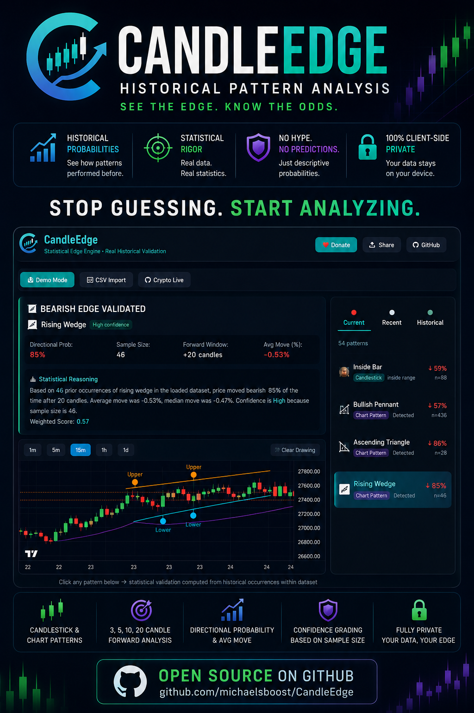

# CandleEdge

*Client-side market structure scanner that detects candlestick and chart patterns, draws detected structures on interactive charts, and computes historical probabilities from your own dataset.*



[](LICENSE)  [](https://github.com/michaelsboost/CandleEdge/stargazers)  [](https://github.com/michaelsboost/CandleEdge/issues)

---

## 📊 About CandleEdge

CandleEdge is an open-source technical analysis tool built with modern web technologies.

It helps traders and analysts understand how specific candlestick and chart patterns have historically behaved within their own market data.

The project focuses on descriptive statistical analysis rather than prediction.

Instead of claiming to forecast markets, CandleEdge analyzes what previously happened after similar historical structures appeared in the loaded dataset.

Questions the tool explores include:

- How often did price move higher after this pattern appeared?
- Did a setup behave differently after 3 candles versus 20 candles?
- How large were the average and median moves?
- Is there enough historical sample size to take the statistics seriously?

All calculations are deterministic and reproducible.

No AI-generated signals.  
No machine learning black boxes.  
No hidden server-side analytics.

Just transparent calculations running directly in the browser.

---

## 🧩 CandleEdge Explained Simply

Imagine loading years of market data into a tool that automatically finds:

- ascending triangles
- falling wedges
- bullish engulfing candles
- bearish pennants
- hammers
- dojis
- momentum structures

Then imagine the software scanning every historical occurrence and showing what price did afterward.

That is what CandleEdge does.

For example:

- one pattern may have moved upward 67% of the time after 10 candles
- another may have failed most of the time after only 3 candles
- another may show strong movement but only have 6 historical occurrences, reducing confidence

CandleEdge does not attempt to predict the future.

Instead, it answers a simpler question:

> “How has this exact structure historically behaved inside this dataset?”

The project is essentially a statistical market structure explorer.

Not:

> “This pattern guarantees profit.”

But:

> “This pattern historically behaved this way under these conditions.”

---

## 📚 Documentation

Additional technical documentation:

- 📘 [Model Notes](docs/model-notes.md) — explains the statistical engine, confidence scoring, weighted edge calculations, and system limitations
- ⚙️ [Function Reference](docs/functions.md) — explains the major JavaScript functions and application architecture

---

## 🧠 What Makes CandleEdge Different

### No AI Hype

Many modern trading platforms advertise “AI-powered predictions.”

CandleEdge intentionally avoids this approach.

The statistical engine uses straightforward calculations:

- historical occurrence counting
- percentage change calculations
- averages
- medians
- probability ratios
- sample-size confidence grading

Everything is transparent and inspectable in the source code.

---

### Fully Client-Side

Your market data never leaves your computer.

CandleEdge runs entirely inside the browser.

- no accounts
- no cloud processing
- no uploaded datasets
- no API keys required
- no server-side analytics

---

### Deterministic & Reproducible

The same dataset produces the same results every time.

No randomness.  
No hidden weighting systems.  
No undisclosed optimization logic.

---

### Built for Exploration

CandleEdge is designed more like a research sandbox than a signal-selling platform.

The purpose is to help users explore:

- structure behavior
- historical tendencies
- statistical edge
- sample reliability
- market context

---

## 📈 Supported Pattern Detection

### Candlestick Patterns

| Pattern | Bias |
|---|---|
| Doji | Neutral |
| Dragonfly Doji | Bullish |
| Gravestone Doji | Bearish |
| Long-Legged Doji | Neutral |
| Spinning Top | Neutral |
| Bullish Engulfing | Bullish |
| Bearish Engulfing | Bearish |
| Bullish Outside Bar | Bullish |
| Bearish Outside Bar | Bearish |
| Inside Bar | Neutral |
| Hammer | Bullish |
| Inverted Hammer | Bullish |
| Hanging Man | Bearish |
| Shooting Star | Bearish |
| Three White Soldiers | Bullish |
| Three Black Crows | Bearish |
| Morning Star | Bullish |
| Evening Star | Bearish |
| Piercing Pattern | Bullish |
| Dark Cloud Cover | Bearish |
| Tweezer Top | Bearish |
| Tweezer Bottom | Bullish |
| Bullish Harami | Bullish |
| Bearish Harami | Bearish |
| Bullish Kicker | Bullish |
| Bearish Kicker | Bearish |
| Bullish Marubozu | Bullish |
| Bearish Marubozu | Bearish |
| NR4 | Neutral |
| NR7 | Neutral |
| Long Lower Wick Rejection | Bullish |
| Long Upper Wick Rejection | Bearish |

---

### Chart Patterns

| Pattern | Bias |
|---|---|
| Ascending Triangle | Bullish |
| Descending Triangle | Bearish |
| Symmetrical Triangle | Neutral |
| Rising Wedge | Bearish |
| Falling Wedge | Bullish |
| Bullish Pennant | Bullish |
| Bearish Pennant | Bearish |
| Bull Flag | Bullish |
| Bear Flag | Bearish |
| Rising Channel | Bullish |
| Falling Channel | Bearish |
| Rectangle Range | Neutral |
| Double Top | Bearish |
| Double Bottom | Bullish |
| Triple Top | Bearish |
| Triple Bottom | Bullish |
| Head and Shoulders | Bearish |
| Inverse Head and Shoulders | Bullish |
| Cup and Handle | Bullish |
| Break of Structure (Bullish) | Bullish |
| Break of Structure (Bearish) | Bearish |
| Liquidity Sweep High | Bearish |
| Liquidity Sweep Low | Bullish |
| Higher High | Bullish |
| Higher Low | Bullish |
| Lower High | Bearish |
| Lower Low | Bearish |
| Support Bounce | Bullish |
| Resistance Rejection | Bearish |

Chart structures are generated using swing-high, swing-low, and local-extrema detection logic and visualized directly on the chart with trendlines and structure markers.

---

## 📊 Statistical Engine

### How It Works

For each detected pattern:

1. Historical occurrences are located throughout the dataset
2. Forward price movement is measured after:
   - 3 candles
   - 5 candles
   - 10 candles
   - 20 candles
3. Bullish vs bearish movement percentages are calculated
4. Average and median returns are computed
5. Sample size reliability is measured
6. The strongest forward window is selected using weighted scoring

---

### Confidence Grading

| Sample Size | Confidence |
|---|---|
| 30+ occurrences | High |
| 15–29 occurrences | Moderate |
| 5–14 occurrences | Low |
| Below 5 | No statistics shown |

Confidence is based strictly on historical sample count.

---

### Weighted Edge Formula

The engine selects the strongest statistical window using:

```txt
Score =
(Directional Strength × 0.5)
+ (Move Magnitude × 0.3)
+ (Sample Reliability × 0.2)
```

This prioritizes directional consistency over raw move size.

---

## 🌟 Features

- ✅ CSV import support
- ✅ Flexible date parsing
- ✅ Historical OHLCV analysis
- ✅ Interactive candlestick charts
- ✅ Candlestick pattern detection
- ✅ Chart pattern detection
- ✅ Historical probability engine
- ✅ Confidence grading
- ✅ Trendline visualization
- ✅ Multi-timeframe resampling
- ✅ Current / Recent / Historical pattern explorer
- ✅ Weighted edge ranking
- ✅ Live crypto market mode
- ✅ Coinbase integration
- ✅ Web Share API support
- ✅ Fully client-side architecture
- ✅ MIT licensed open source

---

## 🛠️ Tech Stack

CandleEdge is built entirely with lightweight browser-native technologies.

### Frontend

- Alpine.js
- Tailwind CSS
- Lightweight Charts

### Data Processing

- PapaParse
- Native JavaScript statistical calculations

### Browser APIs

- File API
- WebSocket API
- Web Share API
- LocalStorage API

### Architecture Goals

- lightweight
- browser-native
- fully client-side
- offline-capable
- easy to fork
- open-source
- no backend required

---

## 🚀 Launch CandleEdge

➡️ **https://michaelsboost.com/CandleEdge**

---

## 📥 Installation & Local Development

Clone the repository:

```bash
git clone https://github.com/michaelsboost/CandleEdge.git
cd CandleEdge
```

Start a local server:

```bash
python3 -m http.server 8000
```

Then open:

```txt
http://localhost:8000
```

No build process required.

---

## 📂 CSV Format

CandleEdge supports CSV files with columns such as:

```txt
DATE,OPEN,HIGH,LOW,CLOSE,ADJ CLOSE,VOLUME
```

Example:

```csv
"DATE","OPEN","HIGH","LOW","CLOSE","ADJ CLOSE","VOLUME"
"May 22, 2026",100.00,105.50,99.50,104.20,104.20,1000000
```

The parser supports:

- quoted headers
- unquoted headers
- Unix timestamps
- human-readable dates
- CLOSE or ADJ CLOSE fallback handling
- automatic invalid-row filtering
- chronological sorting

Minimum requirement:

- 50 valid candles

---

## ⚠️ Disclaimer

CandleEdge is an experimental educational analysis tool.

The statistics shown are descriptive only.

They describe what historically happened inside the loaded dataset and should not be interpreted as guarantees or predictions.

Results depend heavily on:

- dataset quality
- market regime
- historical sample size
- survivorship bias
- simplified pattern definitions

This project is intended for:

- research
- exploration
- learning
- systems thinking
- statistical analysis

Not financial advice.

---

## 🤝 Contributing

Pull requests, ideas, improvements, and bug reports are welcome.

Potential areas for expansion include:

- additional chart structures
- additional candlestick patterns
- statistical export systems
- advanced probability metrics
- drawdown analysis
- multi-timeframe correlation
- backtesting systems
- accessibility improvements
- mobile optimization

---

## 💖 Support

CandleEdge is an independent open-source project built and maintained by one person.

If you find the project useful:

- ⭐ Star the repository
- 📢 Share the project
- 🧠 Contribute improvements
- 💸 Support development: https://michaelsboost.com/donate

Support helps fund future development, testing, research, and additional open-source tools.

---

## 📜 License

CandleEdge is licensed under the MIT License.

See: [LICENSE](LICENSE)

---

## 📧 Contact

Michael Schwartz  
https://michaelsboost.com
